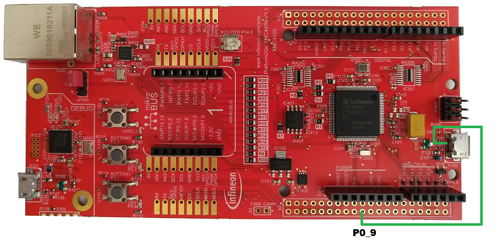
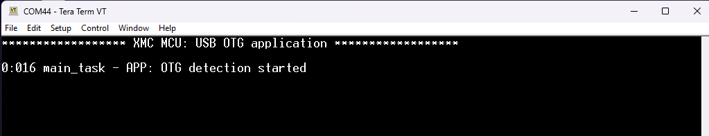
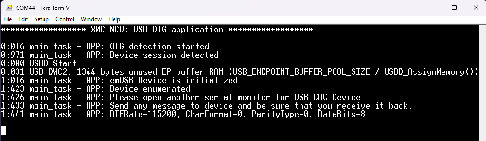
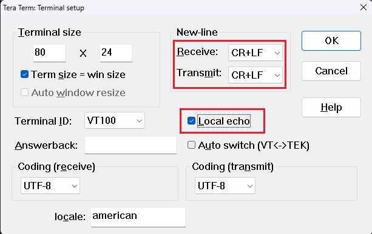
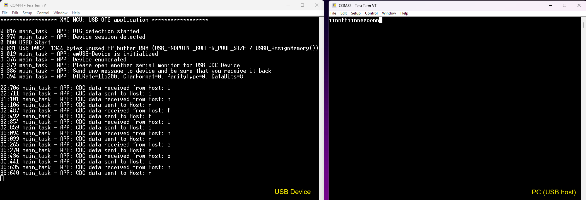
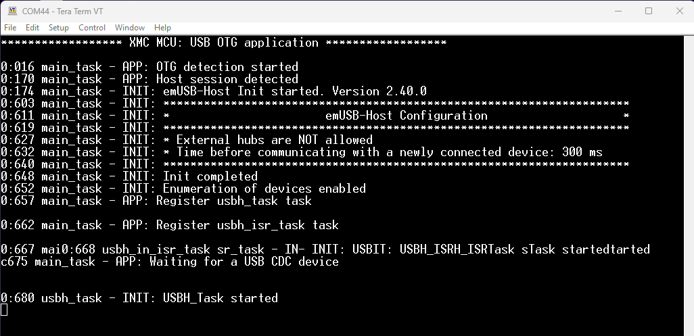
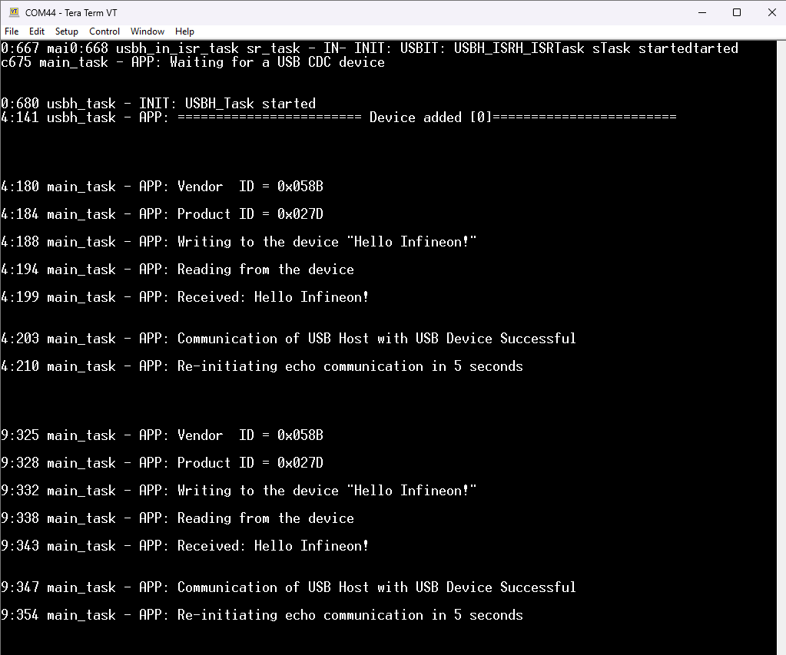
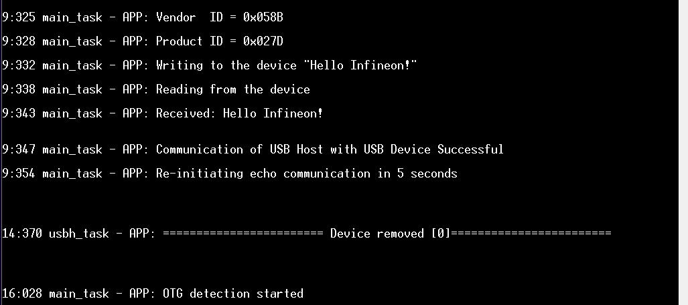

# XMC&trade; MCU: USB OTG application

*Disclaimer: This is a community code example (CCE) released for the benefit of the community users. These projects have only been tested for the listed BSPs, tools versions, and toolchains documented in this readme. They are intended to demonstrate how a solution / concept / use-case can be achieved on a particular device. For official code examples, please click [here](https://github.com/Infineon/Code-Examples-for-ModusToolbox-Software).*

This example demonstrates how to set up the USB block of an Infineon MCU using Segger's emUSB-Host and emUSB-Device middlewares to implement a USB On-The-Go (OTG) that introduces the dual-role device, a device capable of functioning as either host or peripheral. The example uses FreeRTOS.

This example starts the OTG stack and waits until a valid session is detected. After detecting the valid session, the ID pin state detects whether emUSB-Device or emUSB-Host can be initialized.

[View this README on GitHub.](https://github.com/Infineon/cce-mtb-xmc44-usb-otg)

## Requirements

- [ModusToolbox&trade;](https://www.infineon.com/modustoolbox) v3.2 or later (tested with v3.2)
- [SEGGER J-Link software](https://www.segger.com/downloads/jlink/#J-LinkSoftwareAndDocumentationPack)
- Programming language: C
- Associated parts: All [XMC&trade; MCU](https://www.infineon.com/cms/en/product/microcontroller/32-bit-industrial-microcontroller-based-on-arm-cortex-m/) parts
- OTG adapter

## Supported toolchains (make variable 'TOOLCHAIN')

- GNU Arm&reg; Embedded Compiler v11.3.1 (`GCC_ARM`) – Default value of `TOOLCHAIN`


## Supported kits (make variable 'TARGET')

- [XMC4400 Platform2GO XTREME Kit](https://www.infineon.com/cms/en/product/evaluation-boards/kit_xmc_plt2go_xmc4400/) (`KIT_XMC_PLT2GO_XMC4400`) – Default value of `TARGET`


## Hardware setup

XMC4400 Platform2GO XTREME Kit (KIT_XMC_PLT2GO_XMC4400) requires an external connection manually from the USB connector pin 4 to the P0_9 on the board accordingly as in below Figure.

**Figure 1. Hardware setup**




## Software setup

See the [ModusToolbox&trade; tools package installation guide](https://www.infineon.com/ModusToolboxInstallguide) for information about installing and configuring the tools package.

This example requires no additional software or tools.


## Using the code example


### Create the project

The ModusToolbox&trade; tools package provides the Project Creator as both a GUI tool and a command line tool.

<details><summary><b>Use Project Creator GUI</b></summary>

1. Open the Project Creator GUI tool.

   There are several ways to do this, including launching it from the dashboard or from inside the Eclipse IDE. For more details, see the [Project Creator user guide](https://www.infineon.com/ModusToolboxProjectCreator) (locally available at *{ModusToolbox&trade; install directory}/tools_{version}/project-creator/docs/project-creator.pdf*).

2. On the **Choose Board Support Package (BSP)** page, select a kit supported by this code example. See [Supported kits](#supported-kits-make-variable-target).

   > **Note:** To use this code example for a kit not listed here, you may need to update the source files. If the kit does not have the required resources, the application may not work.

3. On the **Select Application** page:

   a. Select the **Applications(s) Root Path** and the **Target IDE**.

   > **Note:** Depending on how you open the Project Creator tool, these fields may be pre-selected for you.

   b. Select this code example from the list by enabling its check box.

   > **Note:** You can narrow the list of displayed examples by typing in the filter box.

   c. (Optional) Change the suggested **New Application Name** and **New BSP Name**.

   d. Click **Create** to complete the application creation process.

</details>


<details><summary><b>Use Project Creator CLI</b></summary>

The 'project-creator-cli' tool can be used to create applications from a CLI terminal or from within batch files or shell scripts. This tool is available in the *{ModusToolbox&trade; install directory}/tools_{version}/project-creator/* directory.

Use a CLI terminal to invoke the 'project-creator-cli' tool. On Windows, use the command-line 'modus-shell' program provided in the ModusToolbox&trade; installation instead of a standard Windows command-line application. This shell provides access to all ModusToolbox&trade; tools. You can access it by typing "modus-shell" in the search box in the Windows menu. In Linux and macOS, you can use any terminal application.

The following example clones the "[XMC&trade; MCU: USB OTG application](https://github.com/Infineon/mtb-example-cce-mtb-xmc44-usb-otg)" application with the desired name "USB_OTG" configured for the *KIT_XMC_PLT2GO_XMC4400* BSP into the specified working directory, *C:/mtb_projects*:

   ```
   project-creator-cli --board-id KIT_XMC_PLT2GO_XMC4400 --app-id mtb-example-cce-mtb-xmc44-usb-otg --user-app-name USB_OTG --target-dir "C:/mtb_projects"
   ```


The 'project-creator-cli' tool has the following arguments:

Argument | Description | Required/optional
---------|-------------|-----------
`--board-id` | Defined in the <id> field of the [BSP](https://github.com/Infineon?q=bsp-manifest&type=&language=&sort=) manifest | Required
`--app-id`   | Defined in the <id> field of the [CE](https://github.com/Infineon?q=ce-manifest&type=&language=&sort=) manifest | Required
`--target-dir`| Specify the directory in which the application is to be created if you prefer not to use the default current working directory | Optional
`--user-app-name`| Specify the name of the application if you prefer to have a name other than the example's default name | Optional

<br>

> **Note:** The project-creator-cli tool uses the `git clone` and `make getlibs` commands to fetch the repository and import the required libraries. For details, see the "Project creator tools" section of the [ModusToolbox&trade; tools package user guide](https://www.infineon.com/ModusToolboxUserGuide) (locally available at {ModusToolbox&trade; install directory}/docs_{version}/mtb_user_guide.pdf).

</details>


### Open the project

After the project has been created, you can open it in your preferred development environment.


<details><summary><b>Eclipse IDE</b></summary>

If you opened the Project Creator tool from the included Eclipse IDE, the project will open in Eclipse automatically.

For more details, see the [Eclipse IDE for ModusToolbox&trade; user guide](https://www.infineon.com/MTBEclipseIDEUserGuide) (locally available at *{ModusToolbox&trade; install directory}/docs_{version}/mt_ide_user_guide.pdf*).

</details>


<details><summary><b>Visual Studio (VS) Code</b></summary>

Launch VS Code manually, and then open the generated *{project-name}.code-workspace* file located in the project directory.

For more details, see the [Visual Studio Code for ModusToolbox&trade; user guide](https://www.infineon.com/MTBVSCodeUserGuide) (locally available at *{ModusToolbox&trade; install directory}/docs_{version}/mt_vscode_user_guide.pdf*).

</details>


<details><summary><b>Command line</b></summary>

If you prefer to use the CLI, open the appropriate terminal, and navigate to the project directory. On Windows, use the command-line 'modus-shell' program; on Linux and macOS, you can use any terminal application. From there, you can run various `make` commands.

For more details, see the [ModusToolbox&trade; tools package user guide](https://www.infineon.com/ModusToolboxUserGuide) (locally available at *{ModusToolbox&trade; install directory}/docs_{version}/mtb_user_guide.pdf*).

</details>


## Operation

1. Connect the board to your PC using a Micro-USB cable through the debug USB connector.

2. Open a serial terminal and select the JLINK CDC UART COM port. Configure the terminal with the following:
      - Baud rate: 115200
      - Data bits: 8
      - Stop bits: 1
      - Parity and flow control: None

3. Program the board using one of the following:

   <details><summary><b>Using Eclipse IDE</b></summary>

      1. Select the application project in the Project Explorer.

      2. In the **Quick Panel**, scroll down, and click **\<Application Name> Program (JLink)**.
   </details>


   <details><summary><b>In other IDEs</b></summary>

   Follow the instructions in your preferred IDE.
   </details>


   <details><summary><b>Using CLI</b></summary>

     From the terminal, execute the `make program` command to build and program the application using the default toolchain to the default target. The default toolchain is specified in the application's Makefile but you can override this value manually:
      ```
      make program TOOLCHAIN=<toolchain>
      ```

      Example:
      ```
      make program TOOLCHAIN=GCC_ARM
      ```
   </details>


4. After programming, the application starts automatically. Confirm that the string **OTG detection started** is displayed on the UART terminal.

   **Figure 2. OTG detection started in terminal**

   

5. Confirm that the user LED blinks.


### Initialize USB device

1. Connect another USB cable from your PC to the USB device connector (see the kit user guide for its location).

2. On the terminal, verify that the **Device session is detected** and **emUSB-Device is initialized** as shown in the following figure:

   **Figure 3. Device session is detected in terminal**

   

3. Open another USB Serial Device COM port in the terminal for USB CDC device. Configure the terminal with the following:
      - Baud rate: 115200
      - Data bits: 8
      - Stop bits: 1
      - Parity and flow control: None

4. In the terminal setup, enable **Local echo** to view the input from the PC (USB host) to the USB device. Additionally, set the **New-line** character for transmit and receive to Carriage Return and Line Feed (**CR + LF**) as shown in the following figure:

   **Figure 4. Terminal settings**

   

5. Provide input to the USB Host using a keyboard connected to the PC. The USB device receives the data from the PC (USB host). The output echoed by the USB device to the PC will appear in the USB host terminal.
   
   **Figure 5. CDC echo terminal output**

   

6. On disconnection from the USB device connector, the user LED blinks to indicate an OTG detection started and waits until a valid session is detected.


### Initialize USB Host

1. Connect the OTG cable to the USB device connector (see the kit user guide for its location).

2. On the terminal, verify that the **Host session is detected** and **emUSB-Host Init started** as shown in the following figure:

   **Figure 6. Host session detected in terminal**

   

3. The USB host waits to connect with the `USB CDC echo device`.

4. Use a USB cable to establish a connection between the OTG cable and the USB host port on the kit (see the kit user guide for its location). 

   > **Note:** Kits that are used as a USB device require an external power via the board's KitProg port.

   See the [USB CDC device echo code example](https://github.com/Infineon/mtb-example-usb-device-cdc-echo) for configuring an Infineon MCU (currently supported on PSoC&trade; 6 MCU) with USB CDC echo functionality.

5. When connected, the host acknowledges the addition of a USB CDC device, enumerates it and starts the echo using the communication device class (CDC). The USB host sends a data packet at every 5 seconds containing the device details such as Vendor ID, Product ID, and the data stream that is sent and received.

   **Figure 7. USB device connected**

   

6. The USB device echoes the data stream back to the host to demonstrate the CDC echo functionality. The packets are continuously sent and received until the physical connection via the cable is disconnected.

   **Figure 8. USB device disconnected**

   

7. For disconnection, if the USB device requires an external power, remove the KitProg connection that powering the kit and then disconnect the device kit from the host kit. The USB host stops the communication, acknowledges the removal of the USB device as shown in **Figure 8** and returns to the wait state until another USB device is connected to start the echo communication.

8. On disconnection from the USB device connector, the user LED blinks to indicate an OTG detection started and waits until a valid session is detected.


## Debugging

You can debug the example to step through the code.


<details><summary><b>In Eclipse IDE</b></summary>

Use the **\<Application Name> Debug (JLink)** configuration in the **Quick Panel**. For details, see the "Program and debug" section in the [Eclipse IDE for ModusToolbox&trade; user guide](https://www.infineon.com/MTBEclipseIDEUserGuide).

</details>


<details><summary><b>In other IDEs</b></summary>

Follow the instructions in your preferred IDE.
</details>


## Design and implementation

This code example uses the FreeRTOS. The following tasks are created in *main.c* file:

- **main_task** - Select Host or Device mode based on connection.

   The main function is responsible for initializing the device, ports, and all other necessary peripherals. It creates the `main_task` function for initializing the OTG stack and waits until a valid session is detected based on the connection.

   As soon as a valid session is detected, checks the ID-pin state to detect whether to initialize `device_app` or `host_app` functions.


###  Device app 

The USB device block is configured to use the Communication Device Class (CDC). After enumeration, the device constantly checks if any data is received from the host. If any data is available, the application copies the received data to a buffer in the SRAM and sends the same data back to the host. For more information on the device app, see the [USB CDC device echo](https://github.com/Infineon/mtb-example-usb-device-cdc-echo) code example.


###  Host app

The `host_app()` function initializes the emUSB-Host middleware stack with the CDC class. The emUSB-Host stack utilizes two dedicated RTOS tasks using FreeRTOS for this code example. 
- `usbh_task`: Manages the internal software timers. It calls the USBH_Task() target API and also invokes the registered callback functions, if the timer runs out. 
- `usbh_isr_task`: Calls the USBH_ISRTask() target API, processes the interrupts generated by the USB host controller and treats it as a highest priority. 

The priorities of both tasks must be higher than the priority of any other application task which uses emUSB-Host. For more information on the usage of emUSB-Host target APIs, see the [emUSB host user guide](https://github.com/Infineon/emusb-host/blob/master/docs/UM10001_emUSBH.pdf) (locally available at *<mtb_shared>/emusb-host/<version-tag>/docs*).

The `host_app()` routine then sets the configuration flags and gets into a wait state requesting the status of the USB bus using the `USBH_CDC_AddNotification` target API and `usb_device_notify` application function. The USB host slowly blinks the user LED indicating to be in the wait state. 

When a USB CDC device with echo functionality is connected to the host via a USB cable:
- The `usb_device_notify` application function sets a non-zero value for `device_ready`.
- The firmware then initiates `device_task()` which handles the echo communication. The `device_task()` routine retrieves the device information, enumerates and configures the CDC device to start the echo communication. It also configures the data packets that are sent by the host to the device. 
- The USB host sends a string data packet using the `USBH_CDC_Write` target API. 
- The echo communication is successful when the USB CDC device echoes the packet back to the host using the `USBH_CDC_Read` target API. 
- The host prints the logs accordingly on the terminal. The host waits for 5 seconds after which it re-initiates the echo communication to the USB device. This process continues until the USB device physically disconnects. 
- When the device disconnects, the `usb_device_notify` application function sets a zero value for `device_ready` and the `host_app()` goes to the wait state till the next connection between the host and device occurs.

For more information regarding the host app, see the [USB CDC Host echo](https://github.com/Infineon/mtb-example-usb-host-cdc-echo) code example.


### OTG driver

USB OTG allows two USB devices to communicate with each other. USB OTG retains the standard USB host/peripheral model, in which a single host communicates to USB peripherals.

To use emUSB OTG, require a driver matching the target hardware, handling both OTG controller and transceiver. The driver interface has been designed to take full advantage of hardware features such as session detection and session request protocol.


## Resources and settings

The project uses a custom *design.modus* file because the following settings are modified in the default *design.modus* file.

**Table 1. Application resources**

 Resource  |  Alias/object           |    Purpose
 :-------- | :---------------------- | :------------
 USB | usb_0                   | USB host block configured with OTG functionality 
 GPIO | ioss_0_port_0_pin_9                   | Configured for USB ID
 GPIO | ioss_0_port_3_pin_2                   | Configured for USB driver bus
 Capture Compare Unit 4 (CCU4) | ccu4_0                   | Configured to set period and compare
 USIC1_CH0 (UART) | CYBSP_DEBUG_UART | UART object used by retarget-io for debug UART port
 GPIO | CYBSP_USER_LED          | User LED
 USB Clock | scu_0_clock_0_usbclk_0          | Configured for USB operation
 USBDIV | scu_0_clock_0_usbdiv_0          | Configured for USB operation
 USB PLL | scu_0_clock_0_pll_usb_0          | Configured for USB operation

<br>


## Related resources

Resources| Links
--------------------|----------------------
Code examples | [Using ModusToolbox&trade;](https://github.com/Infineon/Code-Examples-for-ModusToolbox-Software) on GitHub
Device documentation | [XMC4000 family datasheets](https://www.infineon.com/cms/en/product/microcontroller/32-bit-industrial-microcontroller-based-on-arm-cortex-m/32-bit-xmc4000-industrial-microcontroller-arm-cortex-m4/#document-group-myInfineon-49) <br> [XMC4000 family technical reference manuals](https://www.infineon.com/cms/en/product/microcontroller/32-bit-industrial-microcontroller-based-on-arm-cortex-m/32-bit-xmc4000-industrial-microcontroller-arm-cortex-m4/#document-group-myInfineon-44)
Development kits |[XMC&trade; eval boards](https://www.infineon.com/cms/en/product/microcontroller/32-bit-industrial-microcontroller-based-on-arm-cortex-m/#boards)
Libraries on GitHub | [mtb-xmclib-cat3](https://github.com/Infineon/mtb-xmclib-cat3) – XMC&trade; peripheral driver library (XMCLib) and docs
Middleware on GitHub | [emUSB-Device](https://github.com/Infineon/emusb-device) – SEGGER emUSB-Device for ModusToolbox&trade; <br> [emUSB-Device API reference](https://infineon.github.io/emusb-device/html/index.html) – emUSB-Device API reference <br> [emUSB-Host](https://github.com/Infineon/emusb-host) – SEGGER emUSB-Host for ModusToolbox&trade; <br> [emUSB-Host API reference](https://infineon.github.io/emusb-host/html/index.html) – emUSB-Host API reference
Tools  | [ModusToolbox&trade;](https://www.infineon.com/modustoolbox) – ModusToolbox&trade; software is a collection of easy-to-use libraries and tools enabling rapid development with Infineon MCUs for applications ranging from wireless and cloud-connected systems, edge AI/ML, embedded sense and control, to wired USB connectivity using PSoC&trade; Industrial/IoT MCUs, AIROC&trade; Wi-Fi and Bluetooth&reg; connectivity devices, XMC&trade; Industrial MCUs, and EZ-USB&trade;/EZ-PD&trade; wired connectivity controllers. ModusToolbox&trade; incorporates a comprehensive set of BSPs, HAL, libraries, configuration tools, and provides support for industry-standard IDEs to fast-track your embedded application development.

<br>


## Other resources

Infineon provides a wealth of data at [www.infineon.com](https://www.infineon.com) to help you select the right device, and quickly and effectively integrate it into your design.

For XMC&trade; MCU devices, see [32-bit XMC&trade; industrial microcontroller based on Arm&reg; Cortex&reg;-M](https://www.infineon.com/cms/en/product/microcontroller/32-bit-industrial-microcontroller-based-on-arm-cortex-m/).

## Document history

Document title: *CCE240112* - *XMC&trade; MCU: USB OTG application*

 Version | Description of change
 ------- | ---------------------
 1.0.0   | New code example
<br>


All other trademarks or registered trademarks referenced herein are the property of their respective owners.

The Bluetooth&reg; word mark and logos are registered trademarks owned by Bluetooth SIG, Inc., and any use of such marks by Infineon is under license.

© 2024 Infineon Technologies AG

All Rights Reserved.

### Legal disclaimer

The information given in this document shall in no event be regarded as a guarantee of conditions or characteristics. With respect to any examples or hints given herein, any typical values stated herein and/or any information regarding the application of the device, Infineon Technologies hereby disclaims any and all warranties and liabilities of any kind, including without limitation, warranties of non-infringement of intellectual property rights of any third party.

### Information

For further information on technology, delivery terms and conditions and prices, please contact the nearest Infineon Technologies Office (www.infineon.com).

### Warnings

Due to technical requirements, components may contain dangerous substances. For information on the types in question, please contact the nearest Infineon Technologies Office.

Infineon Technologies components may be used in life-support devices or systems only with the express written approval of Infineon Technologies, if a failure of such components can reasonably be expected to cause the failure of that life-support device or system or to affect the safety or effectiveness of that device or system. Life support devices or systems are intended to be implanted in the human body or to support and/or maintain and sustain and/or protect human life. If they fail, it is reasonable to assume that the health of the user or other persons may be endangered.

----------------------------------------------------------------------------